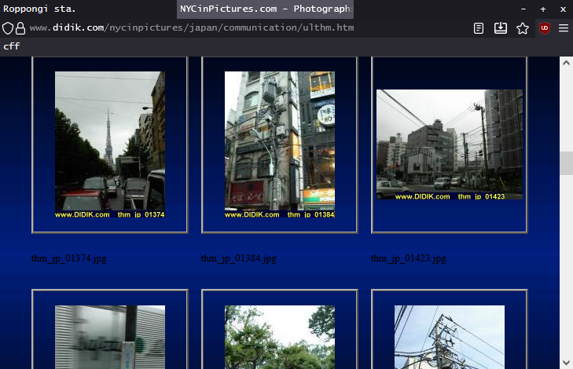

# cff
A collection of styles for a compact, minimalist, keyboard-oriented Firefox theme. Tested on Librewolf on both Linux and Windows.

## Screenshots

 

##  Installation
Clone this repository in your chrome folder:

```sh
git clone https://github.com/mistekko/cff
```

Then import the style sheets somewhere in your `userChrome.css`:
```css
@import url("cff/bookmarks.css");
@import url("cff/menus.css");
@import url("cff/tabs.css");
@import url("cff/urlbar.css");
```

You may also want to set a different font:

```css
* {
    font-size: 14px !important;
    font-family: monospace !important;
}
```

I have two more settings I recommend you configure; they are configured in such a way as I am about to explain on my own machine, so I cannot guarantee that this theme will function without them being set so. They are:
* Remove useless items from the toolbar; to do this, right click any unused space on the tool bar and press `Alt-c` or click "Customize Toolbar...", then customise the toolbar.
* Disable search suggestions and address bar bloat; to do this, go to the section of Firefox's settings titled "Address Bar" (under thea "Search" tab) and untick each box. Similarly, untick each box in the section above. 

## The future
This theme is still rather rough. Expect many improvements, but don't expect them to come quickly.

Here's a list of things I want to make more consistent or prettier:

* context menu colour palette (needs to match rest of application)
* spacing, corners, and other fine details in various rarely seen menus
  * bookmark edit menu (needs to look a fair bit better)
  * space between menus (see screenshot 1)
* icons in menu and their padding (need consistency)

If there's anything I've neglected, feel free to [make an issue](https://github.com/mistekko/cff/issues/new/choose)


