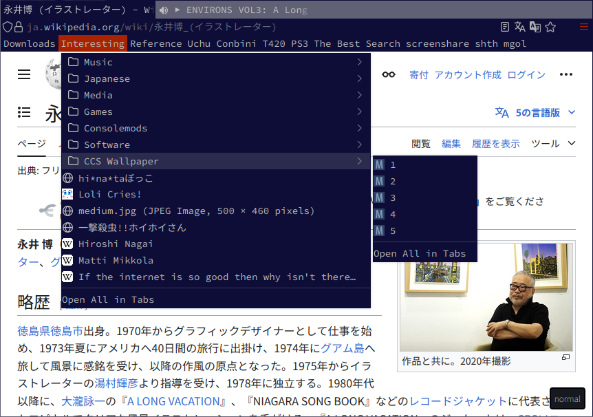
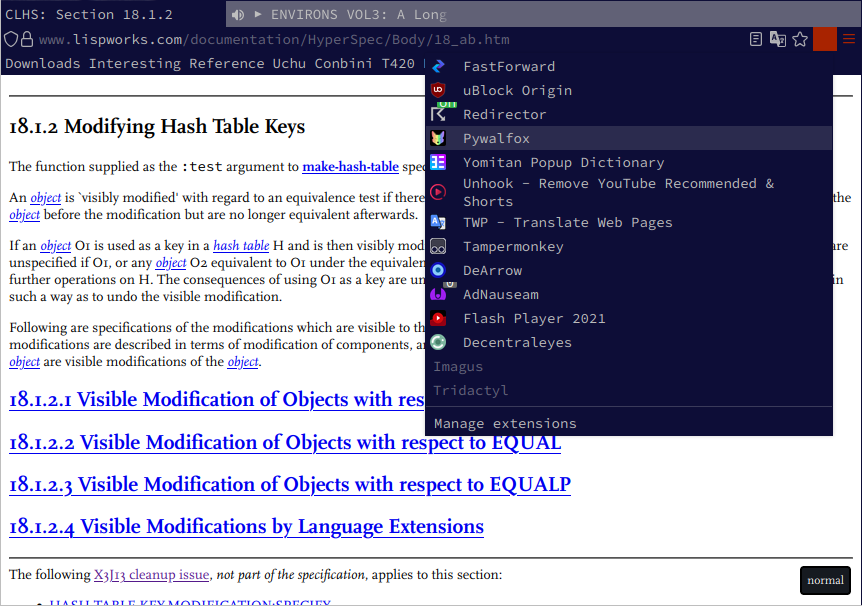

# cff

## Screenshots

 

##  Installation
Clone this repository in your chrome folder:

```sh
    git clone https://github.com/mistekko/cff
```

Then import the style sheets somewhere in your `userChrome.css`:
```css
    @import url("cff/bookmarks.css");
    @import url("cff/menus.css");
    @import url("cff/tabs.css");
    @import url("cff/urlbar.css");
```

You may also want to set a different font:

```css
    * {
        font-size: 14px !important;
        font-family: monospace !important;
    }
```


