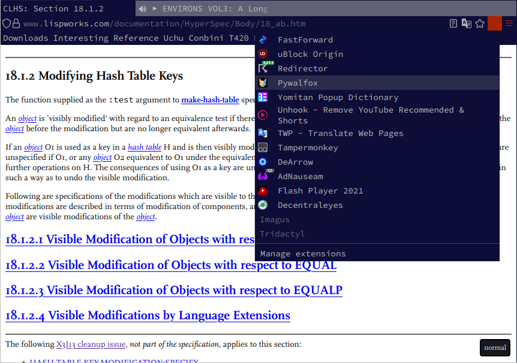
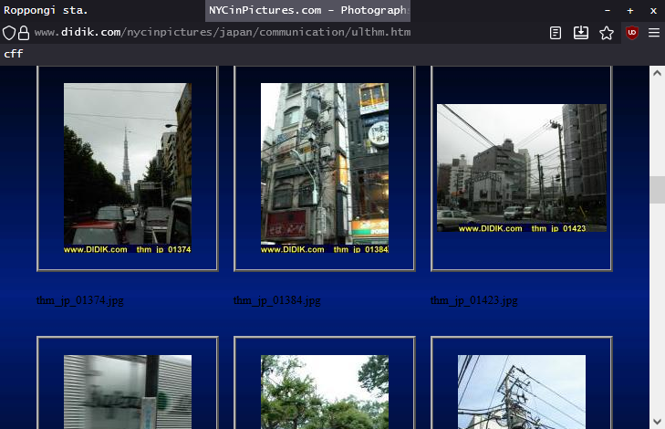

# cff
A collection of styles for a compact, minimalist, keyboard-oriented Firefox theme. Tested on Librewolf on both Linux and Windows.

## Screenshots

 

##  Installation
Clone this repository in your chrome folder:

```sh
git clone https://github.com/mistekko/cff
```

Then import the style sheets somewhere in your `userChrome.css`:
```css
@import url("cff/bookmarks.css");
@import url("cff/menus.css");
@import url("cff/tabs.css");
@import url("cff/urlbar.css");
```

You may also want to set a different font:

```css
* {
    font-size: 14px !important;
    font-family: monospace !important;
}
```

I have two more settings I recommend you configure to get the full experience:
* Remove useless items from the toolbar; to do this, right click any unused space on the tool bar and press `Alt-c` or click "Customize Toolbar...", then customise the toolbar.
* Disable search suggestions and address bar bloat; to do this, go to the section of Firefox's settings titled "Address Bar" (under thea "Search" tab) and untick each box. Similarly, untick each box in the section above. 

### Aero-mode
To give your browser a more stylish look (which currently is only implemented for the tabs), import `aero.css` in your `userChrome.css`, *after you've imported everything else*. It is important that `aero.css` be imported last since it overrides certain styles from other files; if it were imported before them, they would override it instead.

## The Future
Some improvements I intend to make in the future:

* context menu colour palette (needs to match rest of application)
* spacing, corners, and other fine details in various rarely seen menus
* separate-window menus, as are accessed with C-S-y and C-S-o.
* flesh out aero-mode further
* the UIs of more obscure features (e.g. tab-splitting)

If there's anything I've neglected, feel free to [make an issue](https://github.com/mistekko/cff/issues/new/choose)


